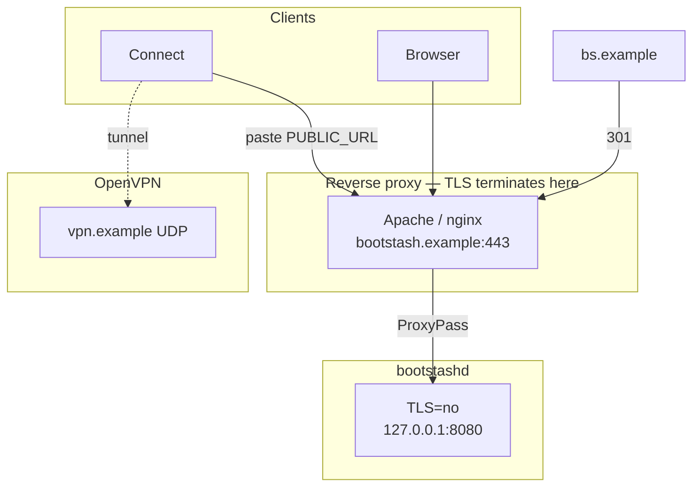
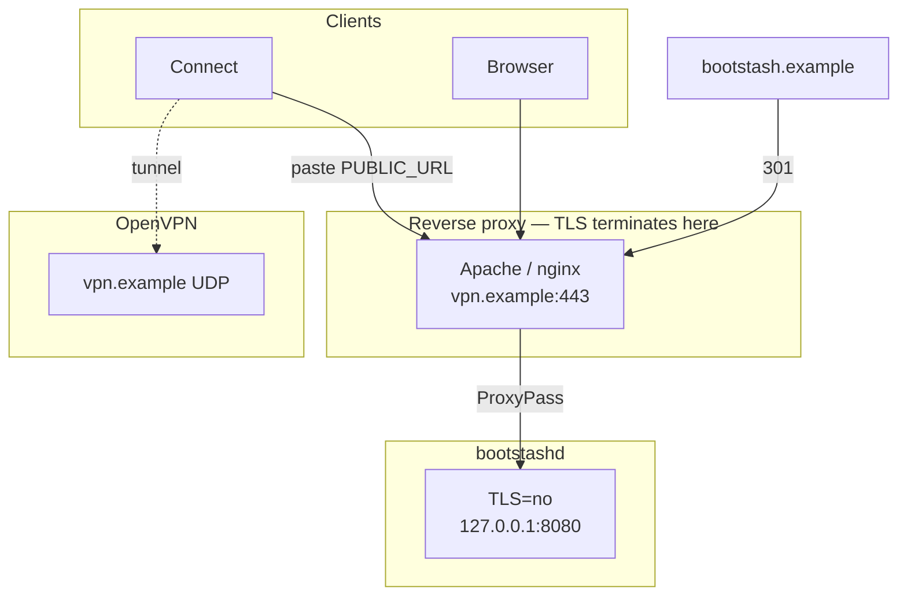
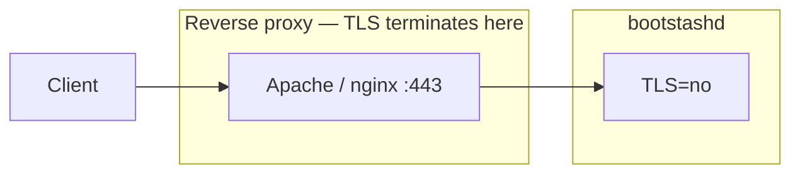
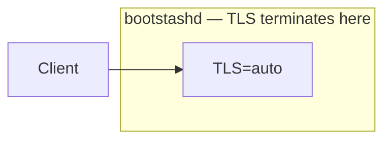
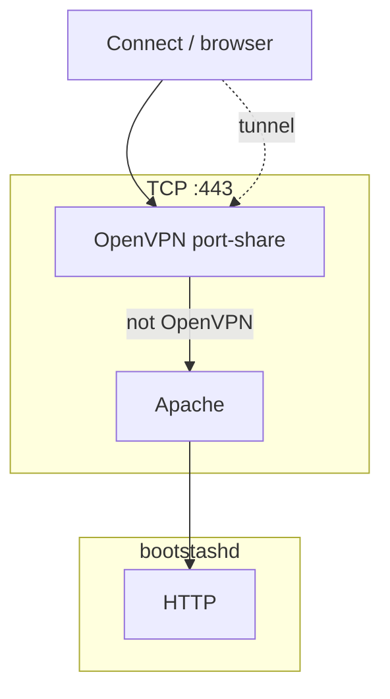
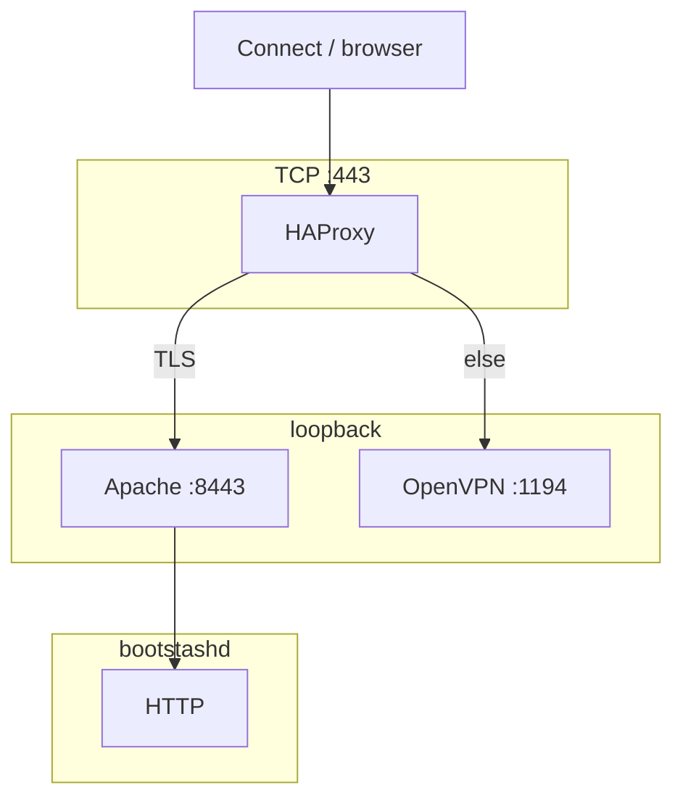
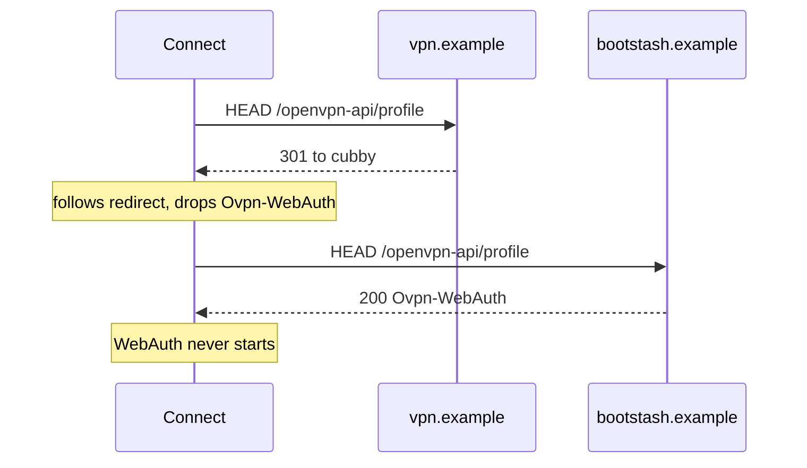

# OpenVPN Connect import

bootstash is a cubby, not a VPN. It does not terminate tunnels. It
hands an `.ovpn` already in **your** folder to [OpenVPN
Connect](https://openvpn.net/client/) on a phone or laptop.

Put the profile in the cubby first (`bootstash put`, upload, or
`cp`). Then paste this cubby’s origin (`PUBLIC_URL`) into Connect —
not a file path, and not OpenVPN `remote` unless those names are
the same.

- **Install:** [`QUICKSTART.md`](QUICKSTART.md)
- **Config:** `bootstash(5)`

## Import

Connect probes `HEAD` / `GET /openvpn-api/profile` on the origin you
paste. After Google and the one-time Linux link:

- One `.ovpn` (any name), or several with a unique `client.ovpn`:
  the page opens Connect (`openvpn://import-profile/…`)
- Several `.ovpn` files with no unique `client.ovpn`: picker; tap
  one (Connect is not opened automatically)
- None: a short empty message, not the file listing

The imported profile’s display name is `remote [filename]` (first
OpenVPN `remote` in the file, then the cubby name). The URL you
paste is still `PUBLIC_URL`. That is not the tunnel endpoint.

Cubby GET of `.ovpn` (the listing) is the file as stored, cookie
only. Save on the import page is an attachment with the Connect
MIME type.

## Capability URL

Connect cannot send the Google session cookie, so URL import uses a
one-time `?token=` HTTPS URL (60 seconds, two GETs, then 404).
Whoever has that URL can fetch **that one** `.ovpn` until it
expires. The clock starts when the import page is rendered (Chrome’s
“Open OpenVPN Connect?” prompt, Connect’s confirm, and a retry).
60 seconds is that handoff envelope, not “private.”

The `openvpn://` link is in the HTML tab. A screenshot, a copied
href, or Android intent extras can leak it for that window.

Cubby listing links still need the session cookie. They are not
this URL.

If you refuse any unauthenticated fetch, disable tokens (below).
Shorter TTL only 404s a slow tap.

## Disable tokens

- **User:** empty regular file `.bootstash-no-ovpn-token` in the
  **root** of your cubby (not a subfolder):

  ```bash
  printf '' > .bootstash-no-ovpn-token
  bootstash put ./.bootstash-no-ovpn-token
  ```

  Presence matters, not content. Remove the file to turn tokens back
  on.

- **Operator:** `OVPN_TOKEN=no` in `/etc/default/bootstash`, then
  `systemctl reload bootstash`. Whole site. Not a substitute for the
  user file.

When tokens are off:

- No `?token=` mint
- Operator off: Connect paste does **not** get `Ovpn-WebAuth` (no
  waiting spinner)
- User file only: Connect paste still opens a browser (the probe
  does not know who you are). After sign-in you get **Save**, not
  `openvpn://`. Cancel Connect’s spinner and import the saved file
- Listing, cookie Save, and cubby GET of `.ovpn` still work. Import
  the file in Connect (file picker). Do not expect paste-origin to
  finish

## Origin models

One `PUBLIC_URL`. Extra DNS names `Redirect` only. Do not
`ProxyPass` two names. Do not `ServerAlias`. HTTPS cookies are
host-only.

### A — cubby origin

`PUBLIC_URL=https://bootstash.example`. Browser and Connect talk to
that host. OpenVPN `remote` is a different name (`vpn.example`
UDP). Extra names (`bs`) 301 to bootstash. Sample vhost:
`/usr/share/doc/bootstash/examples/apache-vhost.conf`.



### B — VPN origin

`PUBLIC_URL=https://vpn.example`. That name is the proxy
`ServerName`. Extra cubby names 301 **to vpn**. Connect pastes vpn.
Tunnel is still `remote vpn` UDP. TCP 443 is HTTPS unless a mux
owns that port (below). OpenVPN must not bind the same TCP port as
the HTTPS daemon.



### TLS termination

Usual: the reverse proxy terminates TLS. Packaged listen is
loopback HTTP (`TLS=no`). Write `PUBLIC_URL` as `https://…`. The
daemon ignores `X-Forwarded-*`.



No proxy: bootstashd terminates TLS (`TLS=auto`, PEMs under
`certs/`). Finding certs does not move `LISTEN` to 443.



### Sharing TCP 443

OpenVPN TCP and HTTPS cannot both bind 443. Pick one mux, or put
HTTPS on another name (origin A).

OpenVPN binds 443: no HTTPS on that port. Origin B is not this.

OpenVPN `port-share`: OpenVPN is the mux. It binds 443 and forwards
non-OpenVPN TCP to Apache. Apache sees `127.0.0.1`. Fine if you do
not expect full Connect integration (paste `PUBLIC_URL`,
`Ovpn-WebAuth`, capability URL). The cubby through Apache still
works; import the saved `.ovpn` in Connect’s file picker.



HAProxy: HAProxy binds 443. TLS ClientHello goes to Apache on
loopback; everything else to OpenVPN on a private socket. The
`.ovpn` still dials 443. Connect paste works (the probe is TLS).
Copy `/usr/share/doc/bootstash/examples/haproxy-local.cfg` to
`/etc/haproxy/haproxy-local.cfg`.

Keep `CONFIG` on stock `/etc/haproxy/haproxy.cfg`. In
`/etc/default/haproxy`:

```
EXTRAOPTS="-S /run/haproxy-master.sock -f /etc/haproxy/haproxy-local.cfg"
```

That is `-f haproxy.cfg -f haproxy-local.cfg`. Do not set `CONFIG`
to the local file alone (no `global`/`defaults` from stock).

Apache must listen only on loopback and enable `mod_remoteip`, or
anyone who can reach 8443 can spoof client IPs: `Listen
127.0.0.1:8443`, `a2enmod remoteip`, `RemoteIPProxyProtocol On`.
The sample vhost’s `*:443` is that loopback port. nginx:
`listen 127.0.0.1:8443 proxy_protocol`.



Also not origin models: two `ProxyPass` origins, `ServerAlias`.

A 301 from the pasted host onto another name is the same class of
failure as a 302 to `/login`:


