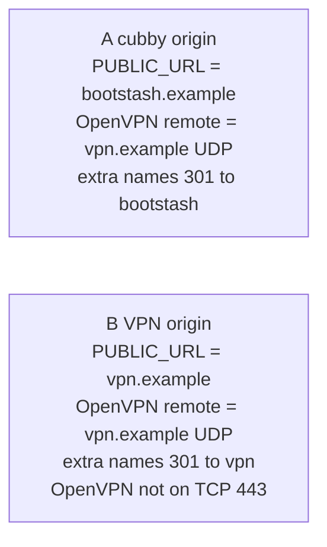
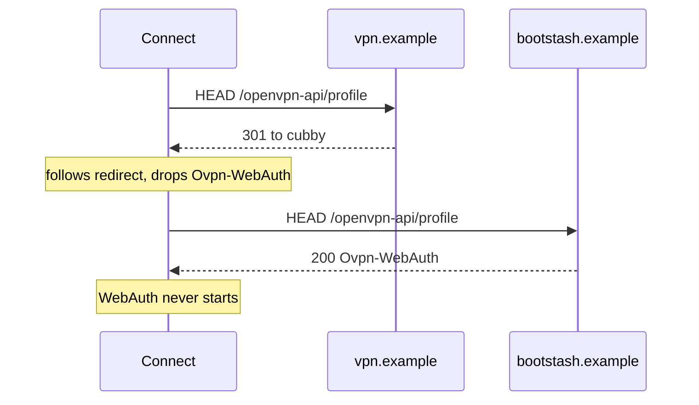

# Quick start

## First run

`sudo dpkg -i` the `.deb`.

Note the messages it prints about what is still needed.

Edit `/etc/default/bootstash` if `LISTEN` or the browser URL are not the
defaults (see below). Then:

```bash
sudo bootstash check-config
# or: sudo bootstashd -t
sudo bootstash provision-google
sudo systemctl enable --now bootstash
```

Package configure does not enable the unit. First install without a
Google client ID stays down. Configure prints what is still needed.

`bootstash provision-google` cannot create the Google OAuth web client on its
own (`gcloud` has no API for that type).

It prints recommended values for:

- The project
- The branding screen
- The Web application client
- The redirect URI from the loaded config

The printed URI uses `https` when both PEMs exist and `TLS` is not
`no`. The port comes from `LISTEN`; finding certs does not move it to
443.

When the client is created, the console shows:

- a copyable client ID
- a copyable secret
- a download link for the client JSON

Pass `-json path`, or with no `-json` it asks for the path to that
file. It copies the JSON to `/etc/bootstash/oidc-google.json`
(`0640` `root:bootstash`). You can copy the download there yourself
under that exact name. The copyable ID and secret are already in the
file; do not paste them into `/etc/default/bootstash`.

## Config

`/etc/default/bootstash` ships with commented `DATA`, `LISTEN`,
`PUBLIC_URL`, and `ADMIN_USERS`. Add only what you need to change.
Packaged operator keys stay in `/usr/lib/bootstash/default-dist`.
OIDC client id/secret and `OIDC_CRYPTO` are not in that file.

Configure runs `letsencrypt-deploy sync`, which copies one matching
`live/` lineage into `/etc/bootstash/certs/<name>/`. The daemon
derives `CERT_NAME` and `PUBLIC_URL` from that dest. Write those keys
to pin them.

If you delete the conffile, `dpkg -i` will not put it back. Configure
restores the packaged pointer from `/usr/lib/bootstash/default`, or
use `dpkg --force-confmiss -i`.

## Listen

Packaged listen is `127.0.0.1:8080`. Set `LISTEN` before another host can
reach you:

- interface
- CIDR of local addresses
- one address, or `*` (any)
- `unix://` (HTTP only, for a local proxy)

Interface binds retry if the NIC is late.

## Browser URL

`PUBLIC_URL` is the URL the **browser** uses for the OIDC callback.
Google never connects to you.

When unset:

- `CERT_NAME` (see TLS) plus the first listen port, or
- `hostname -f` if there is no `CERT_NAME`

Packaged `TLS=auto` uses `https` if cert and key are present. `TLS=no`
forces HTTP.

That name must resolve and reach this daemon. If you bind only a
tunnel NIC but the origin is a public `:443` vhost, the callback
misses.

Google sign-in errors:
[`README.md`](README.md#oidc-troubleshooting).

## Origin models

One `PUBLIC_URL`. OpenVPN Connect pastes that HTTPS origin, not a
file path and not `remote` unless those names are the same.
`.ovpn` files already in the cubby are what that import opens.
Extra DNS names `Redirect` only. Do not `ProxyPass` two names.
Do not `ServerAlias`. HTTPS cookies are host-only. Sample vhost is
layout A (`/usr/share/doc/bootstash/examples/apache-vhost.conf`).

- **A — cubby origin.** `PUBLIC_URL=https://bootstash.example`.
  Browser and Connect talk to that host. OpenVPN `remote` is a
  different name (`vpn.example` UDP). Extra names (`bs`) 301 to
  bootstash
- **B — VPN origin.** `PUBLIC_URL=https://vpn.example`. That name
  is the proxy `ServerName`. Extra cubby names 301 **to vpn**.
  Connect pastes vpn. Tunnel is still `remote vpn` UDP. Apache
  owns 443. OpenVPN must **not** listen on TCP 443

Not a model: OpenVPN TCP on 443 and Apache on the same address.
Two `ProxyPass` origins. `ServerAlias`. 301 from vpn onto a
different cubby host (Connect’s probe follows and drops
`Ovpn-WebAuth`).



A 301 from the pasted host onto another name is the same class of
failure as a 302 to `/login`:



## TLS and Let’s Encrypt

Not an ACME client. It uses certs already on disk. Default files,
when both exist:

- `/etc/bootstash/certs/<name>/fullchain.pem`
- `/etc/bootstash/certs/<name>/privkey.pem`

`name` is `CERT_NAME`. If that is unset, the hook picks:

- `PUBLIC_URL` host
- `live/$(hostname -f)`
- the **only** `live/` lineage (it will not guess when there are several)

After the copy, the daemon uses that directory as `CERT_NAME` and
defaults `PUBLIC_URL` from it.

Do **not** point `TLS_CERT` / `TLS_KEY` at `/etc/letsencrypt/live`.
Treat `certs/` as hook-managed only (see README Known issues).
`ssl-cert` (`Recommends`) is only for `/etc/ssl/private`. Let’s
Encrypt files belong under `/etc/bootstash/certs/`.

Packaged `TLS=auto` uses those PEMs when both exist.

`TLS=no` keeps TCP binds on HTTP:

- The hook does **not** copy `live/` into `/etc/bootstash/certs`
- Dest PEMs there are removed so `User=bootstash` does not hold an
  unused private key
- `live/` is untouched
- A reverse proxy can terminate TLS; write `PUBLIC_URL` as the
  browser URL
- After setting `TLS=no`, run `letsencrypt-deploy sync` (or wait for
  the next renew) to drop dest keys already copied

The packaged hook is `/usr/lib/bootstash/letsencrypt-deploy` (also
`/etc/letsencrypt/renewal-hooks/deploy/bootstash`). It copies **that
one** lineage, not every cert on the box.

- **Issue and renew:** certbot runs the hook for the chosen name.
  Unrelated lineages are skipped. `TLS=no` skips the copy and
  removes dest PEMs. Do not run it on a timer
- **Install and upgrade:** `letsencrypt-deploy sync`. One lineage on
  the box is enough; several lineages and no chosen name **prints**
  the list. `TLS=no` removes dest PEMs instead of copying
- **Force a name:** `CERT_NAME=stash.example` in
  `/etc/default/bootstash`, then
  `sudo /usr/lib/bootstash/letsencrypt-deploy sync`

Manual copy of one lineage (same as certbot’s environment):

```
RENEWED_LINEAGE=/etc/letsencrypt/live/stash.example \
RENEWED_DOMAINS=stash.example \
  /usr/lib/bootstash/letsencrypt-deploy
```

Then `systemctl reload bootstash` if the daemon is already up (the
hook does that when the service is active).

## Users and files

To see who is linked: `sudo bootstash links` (PAM name, issuer, `sub`).
To drop a user's Google->Linux map (they must link again; the cubby
stays): `sudo bootstash unlink alice`. Changing or disabling the Unix
account does not drop the map.

After link, that Unix user can put files into the cubby (not root):

```bash
bootstash put ./id_ed25519
bootstash put ./kit/ keys/
```

Or ordinary `cp` into `/var/lib/bootstash/users/<name>/`. Keep
ownership as yourself.

- Use `bootstash put`, or ordinary `cp`, not `cp -a` (`-a` can keep
  another group)
- The cubby is `2770` `you:bootstash`; new files get group `bootstash`
  so the daemon can read them
- Opening a file under `/home` (or start/SIGHUP) sets group `bootstash`
  and `0640` (so `0644`/`0600` copies work)
- Do not `chown` files to `bootstash`
- Do not add yourself to the `bootstash` group
- Other logins cannot list `users/` or enter someone else’s cubby

## Reload and logs

`systemctl reload` is SIGHUP:

- operator file
- secrets
- CIDR/interface binds
- cubby modes
- certs when TLS is on

Logs go to the journal.

## What the package does on install

Configure does not enable the unit.

- If the daemon is already running, it `try-restart`s after cert sync
  (copy, or dest PEM removal when `TLS=no`)
- If it is down, it starts only when `bootstash check-config` would
  pass (same as `bootstashd -t`)
- First install without a Google client id stays down
- Configure prints what is still needed: daemon not started or not
  enabled on boot, no Google client id, loopback LISTEN, no copied
  certs unless `TLS=no`

## `man` pages

- Config keys: `man 5 bootstash`
- Daemon: `man 8 bootstashd`
- CLI: `man 8 bootstash`

## See also

Google sign-in errors: [`README.md`](README.md#oidc-troubleshooting).
Changing the code: [`DEVELOPERS.md`](DEVELOPERS.md). Building:
[`BUILDING.md`](BUILDING.md).
